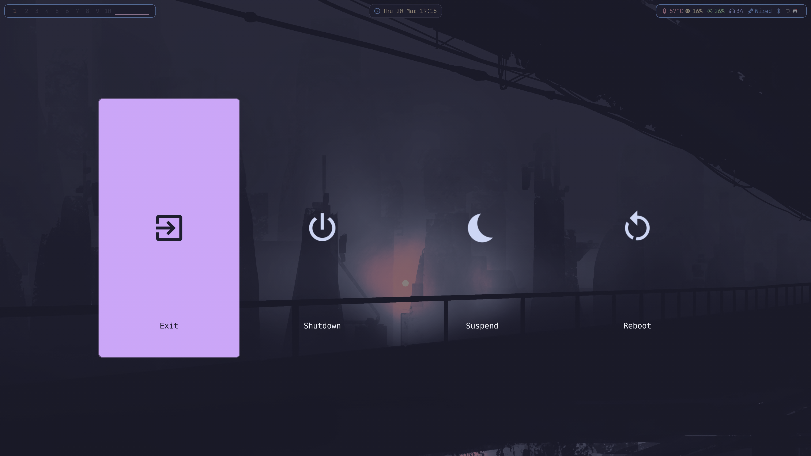
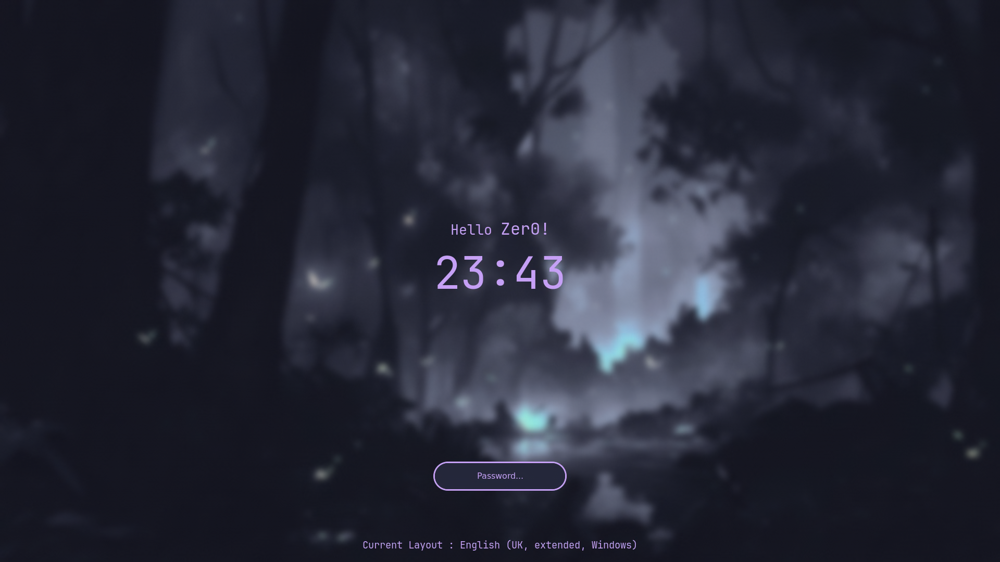

<h1 align="center">
    
   <br>
      My NixOS Configuration
   <br>
       <br>
   <div align="center">
</h1>

## Why so many branches?

I've been learning Nix/NixOS for about a year now. Each branch was/is another
version of the same flake either from the origonal fork of Sly-Harvey on github,
or other things i've faffed about with. Now, im rewriting what i hope to be my
final flake in this branch temporarily named `re-re-rewrite`. This branch will
be more akin to my origonal home-manager setup as its what im most comfortable
with and what I believe to be the 'best format' in my personal preference.

> everything below is remnants of the old readme.

## Screenshots


<details>
<summary>More screenshots</summary>





</details>

## Table of Contents

- [Installation](#installation)
  <!-- - [Before You Begin](#before-you-begin) -->
  <!-- - [Installation Steps](#installation-steps) -->
- [Usage](#usage)
  - [Managing Hosts](#managing-hosts)
  - [Rebuilding](#rebuilding)
  - [Rollbacks](#rollbacks)
  - [Keybindings](#keybindings)
- [Development Shells](#development-shells)
- [Credits](#creditsinspiration)

## Installation

> [!Note]
> Before proceeding with the installation, check these files and adjust them for your system:
>
> - `hosts/Default/variables.nix`: Contains host-specific variables.
> - `hosts/Default/host-packages.nix`: Lists installed packages for the host.
> - `hosts/Default/configuration.nix`: Module imports for the host and extra configuration.

<!-- You can install this configuration either on a running system or from the NixOS live installer. The minimal ISO is recommended and can be downloaded from the [official NixOS website](https://nixos.org/download/#nixos-iso). -->

You can install on a running system or from the NixOS live installer. Get the minimal ISO from the [NixOS website](https://nixos.org/download/#nixos-iso).

### Installation Steps

1. Clone the Repository:

```bash
git clone https://github.com/Sly-Harvey/NixOS.git ~/NixOS
```

<!-- 2. Navigate to the Directory: -->

2. Change Directory:

```bash
cd ~/NixOS
```

3. Run the Installer:

```bash
./install.sh
```

<!-- The script handles host setup, username configuration, and automatically generates `hardware-configuration.nix` based on your hardware. -->

The install and rebuild scripts automate the setup process, including hosts, username, and applying the configuration. It also automatically generates the hardware-configuration.nix file based on your system's detected hardware, eliminating the need to manually generate it.

## Usage

### Managing Hosts

**Method 1: Automatic** - run the installer again to select or create another host:

```bash
./install.sh
```

**Method 2: Manual:**

1. Copy `hosts/Default` to a new directory (e.g., `hosts/Laptop`)
2. Edit the new host's `variables.nix` and `host-packages.nix`
3. Add the host to `flake.nix`:

   ```nix
   nixosConfigurations = {
     Default = mkHost "Default";
     Laptop = mkHost "Laptop";
   };
   ```

4. Track the new host with git:
   ```bash
   git add hosts/Laptop
   ```

<!-- 4. Rebuild with the new hostname (see below) -->

5. Rebuild with the new hostname using either `nixos-rebuild` or `nh` (see [Rebuilding](#rebuilding) below). Once rebuilt, any rebuilding method can be used, as the host name will be implicitly recognised.

### Rebuilding

Apply configuration changes:

- **Keyboard shortcut:** `Super + U`
- **rebuild script:** `rebuild`
- **nixos-rebuild:** `sudo nixos-rebuild switch --flake ~/NixOS#<HOST>`
- **nh:** `nh os switch --hostname <HOST>`

Replace `<HOST>` with the name of your host (e.g., `Laptop`).

### Rollbacks

List generations:

```bash
list-gens
```

Rollback to generation N:

```bash
rollback N
```

Replace `N` with the generation number (e.g., `69`).

### Keybindings

View all keybindings with `Super + ?` or `Super + Ctrl + K`.

## Development Shells

Pre-configured dev shells for various languages are included.

Initialize a project from a template:

```bash
nix flake init -t ~/NixOS#<TEMPLATE_NAME>
```

Create a new project directory:

```bash
nix flake new -t ~/NixOS#<TEMPLATE_NAME> <PROJECT_NAME>
```

Templates are defined in `dev-shells/default.nix` (python, node, etc.).

Enter the shell:

```bash
cd <PROJECT_NAME>
nix develop
```

If you're using direnv, the shell activates automatically.

## Credits/Inspiration

| Credit                                                        | Reason                       |
| ------------------------------------------------------------- | ---------------------------- |
| [Hyprland-Dots](https://github.com/JaKooLit/Hyprland-Dots)    | Scripts and Waybar templates |
| [HyDE](https://github.com/HyDE-Project/HyDE)                  | Additional scripts           |
| [rofi](https://github.com/adi1090x/rofi)                      | Rofi launcher styles         |
| [dev-templates](https://github.com/the-nix-way/dev-templates) | Development templates        |
| [Vimjoyer](https://www.youtube.com/@vimjoyer)                 | NixOS tutorials              |

<!-- ---

## ⭐ Star History

<details>
<summary>View Star History</summary>

<a href="https://github.com/Sly-Harvey/NixOS/stargazers">
 <picture>
   <source media="(prefers-color-scheme: dark)" srcset="https://api.star-history.com/svg?repos=Sly-Harvey/NixOS&type=Date&theme=dark" />
   <source media="(prefers-color-scheme: light)" srcset="https://api.star-history.com/svg?repos=Sly-Harvey/NixOS&type=Date" />
   
 </picture>
</a>

</details> -->
